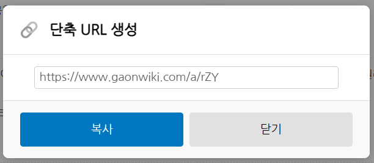

# 개요
미디어위키에서 'Hello'란 문서의 URL은 `https://test.wiki.com/w/Hello` 대충 이런 식입니다. 도메인이 짧거나 문서명이 짧으면 그나마 다행이지만, 영어 단어 중 가장 긴 단어인 'Pneumonoultramicroscopicsilicovolcanoconiosis'인 경우, 일일이 입력하는건 매우 어렵죠.

그래서 확장기능으로 문서의 단축 URL을 제공합니다.

예시:
 

# 라이선스
MIT 라이선스로 제공됩니다.